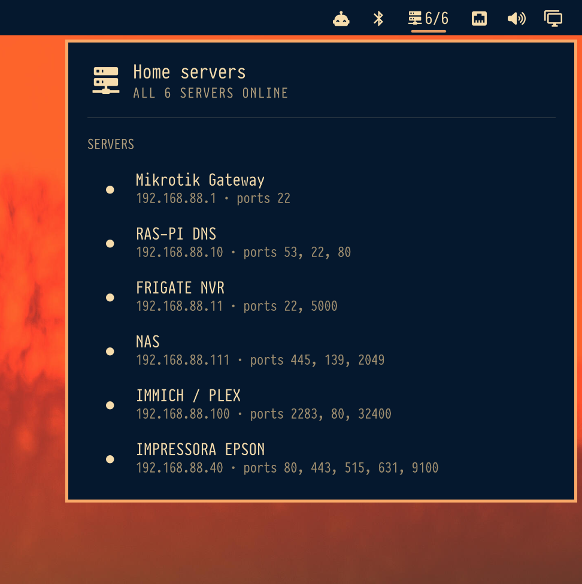

# Network Checker

Bar widget for [Omarchy](https://omarchy.org/) Quattro. It pings the hosts in your config and checks their ports. Offline machines light up on the bar.



## Install

```sh
omarchy plugin add https://github.com/dr-moreira/omarchy-network-checker.git --enable
```

That is enough to enable the widget. Then add your hosts:

```sh
mkdir -p ~/.config/network_checker
cp ~/.config/omarchy/plugins/io.github.dr-moreira.network-checker/checker/config.example.toml \
  ~/.config/network_checker/config.toml
```

Edit `~/.config/network_checker/config.toml`. The widget already speaks that file; no compiler is required.

```toml
[[servers]]
name = "NAS"
host = "192.168.1.10"
ports = [22, 445]
```

## Usage

- Left click — open or close the list
- Middle or right click — refresh
- Click a row — copy the host (`wl-copy`)
- `r` — refresh
- Escape — close

```sh
omarchy bar move io.github.dr-moreira.network-checker --section right
omarchy-shell shell summon io.github.dr-moreira.network-checker '{}'
omarchy-shell shell hide io.github.dr-moreira.network-checker
```

## Settings

On the `io.github.dr-moreira.network-checker` bar entry in `~/.config/omarchy/shell.json`:

| Key | Default | Meaning |
| --- | --- | --- |
| `refreshIntervalSec` | `60` | How often to poll |
| `command` | empty | Optional checker binary (`network_checker`) |
| `configFile` | empty | Optional TOML path (`--file`) |

Needs `python3`, `ping` (`iputils`), and `wl-copy` to copy a host.

## Optional Rust CLI

The same report is available from the bundled Rust program if you want a standalone binary or `--daemon` notifications:

```sh
PLUGIN="$HOME/.config/omarchy/plugins/io.github.dr-moreira.network-checker"
cargo build --release --manifest-path "$PLUGIN/checker/Cargo.toml"
cp "$PLUGIN/checker/target/release/network_checker" ~/.local/bin/network_checker
```

```sh
network_checker --json
network_checker --daemon
network_checker --file ~/.config/network_checker/config.toml
```

Point the widget at it with `"command": "/home/you/.local/bin/network_checker"`.

## Remove

```sh
omarchy plugin remove io.github.dr-moreira.network-checker
```

Your `~/.config/network_checker/config.toml` is left in place.

## License

MIT
